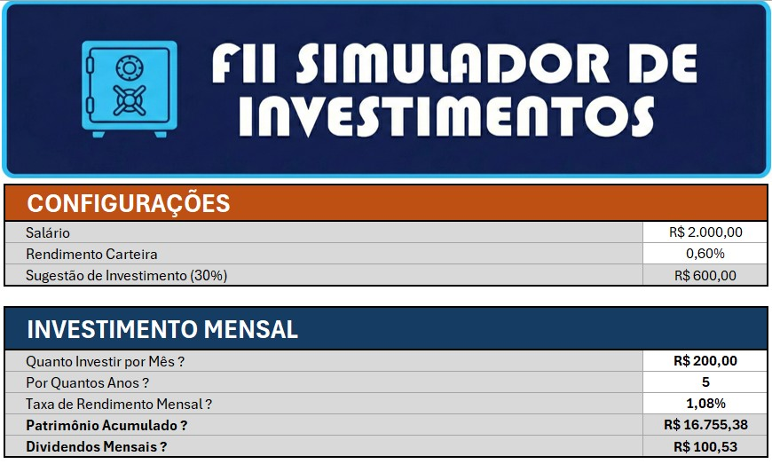
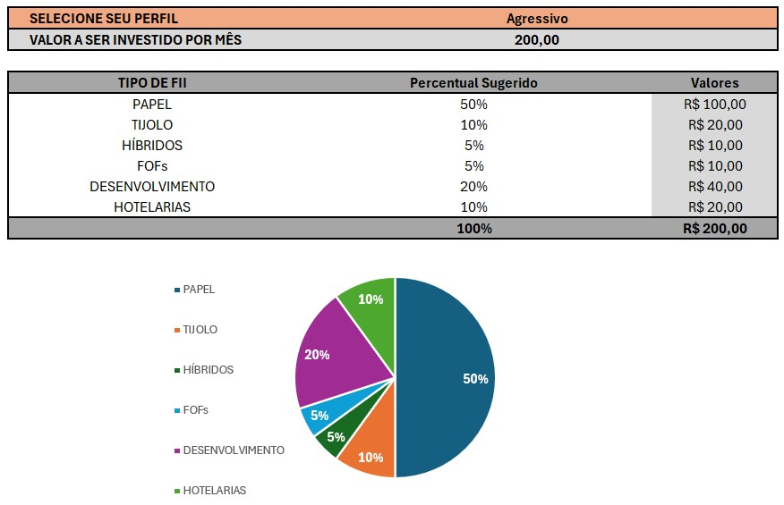

# Simulador de Investimentos Fundos Imobiliarios / Curso DIO

## 📋 Descrição
Esta planilha foi desenvolvida para o curso Bootcamp Santander Excel da DIO e tem como objetivo realizar a simulação de um investimento em fundos imobiliários indicando os rendimentos mensais e dividendos de acordo com o aporte mensal, além de indicar a melhor distribuição do aporte nos diferentes tipos de FII de acordo com seu perfil de investidor.

## 🚀 Funcionalidades
* **Simulação de investimento:** Entradas e saídas automatizadas.
* **Dashboard:** Gráfico visual para análise da distribuição do aporte nos diferentes tipos de FII.

## 🛠️ Tecnologias Utilizadas
* Microsoft Excel 
* Google Gemini para criação da logo 

## 📸 Capturas de Tela
Abaixo estão exemplos do funcionamento da planilha:

## Autor
[Andreia Pontes]
[www.linkedin.com/in/andreia-cristina-pontes-8a55aa]
